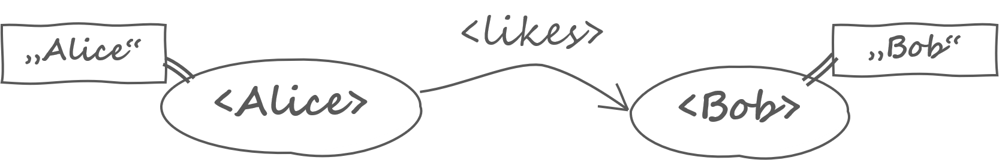
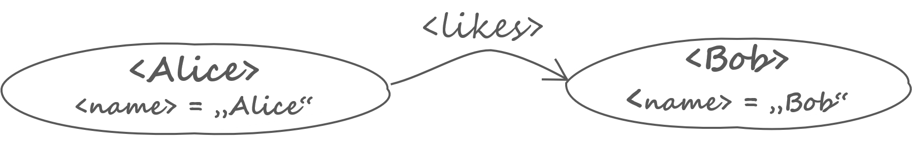
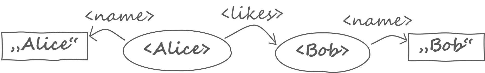
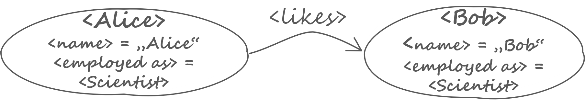
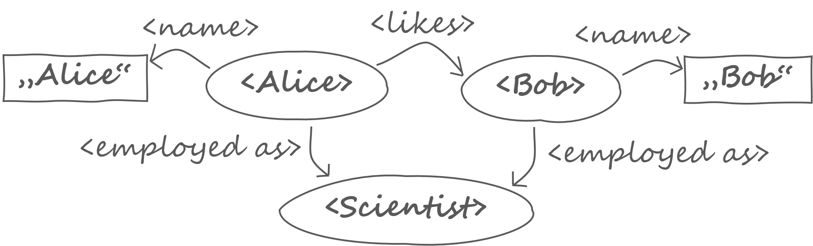
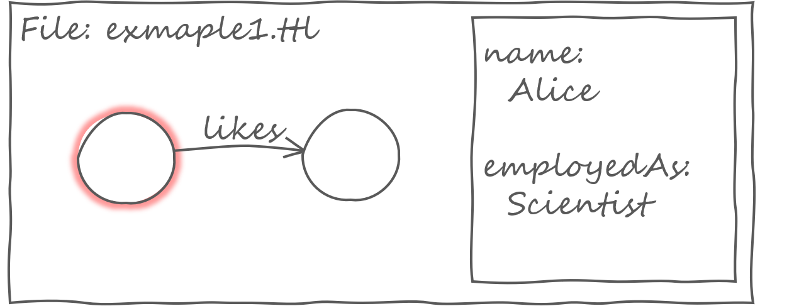

# On Graphs And Models


## Abstract

This is an essay about graphs and and models.
The main question is how to bring together __Resource Description Framework__ and __Property Graph__. The bridge is not a technical thing like RDF-star. The main difference between RDF and Property Graph lies deeper in basic decisions how to do modeling. Within this essay I will investigate the modeling styles and how they are connected to different graph styles. 

The essay opens a generalized view on graphs and modeling which in in turn is the basis for technical solutions that bridge RDF and and the Property Graph world.


## Making a Model

### Alice and Bob

<figure>

<figcaption>Image 1.</figcaption>
</figure>

Let's talk about Alice and Bob. Alice is very fond of Bob, but there feelings of Bob for her are unknown. We now draw a picture of this situation. What we have done is already a model. A __model__ is an image of something, a simplified image of reality or a concept.

Our model has a concern: it is about persons and their relationship. There are things which are of interest and other things which are not considered here.
When we gossip about Alice and Bob it might also be of interest that Bob is a tall, handsome man or that Alice has a new hairstyle. For the moment, we are ignoring all these facts. We can reduce our model so that it reflects only what we are talking about.

<figure>

<figcaption>Image 2.</figcaption>
</figure>
 

The new model is more abstract than the first. Can we continue with this abstracting process? If we look closely at the second image we see that the model consists of specific _elements_: There are bubbles, an arrow and words. The bubbles and the arrow are very different . 
Without knowing it we have already made a design decision: we are distinguishing between things and their relationship. Things are represented by bubbles and relationships are represented by arrows. To be able to recognize who we are talking about we use the individuals' names.
The bubbles represent things which are _identified_ by a name.
Also the relationship is identified by a word 'likes'.

So far everything seemed to be very natural. If we develop our model further we have to we make more design decisions. This is a crucial point because the next steps are not mandatory, but each step is a decision.


### Naming Things Unambiguously 

One might ask: "I know two women with the name 'Alice'. Which one do you mean?". Of course, we could simply use the family name, but let us try to solve this problem once for all.

Creating an unique name is a very hard problem. You cannot prevent anybody of using the same name for something different. The only solution is to have a system that provides the technical and organizational means allows you to create, register and look up names globally. [__Uniform Resource Identifier (URI)__](https://tools.ietf.org/html/rfc3986) allow you to do exactly this.

Let's create URIs for Alice and Bob. The technical Details of these URIs are not of interest here, therefore I simply write `<Alice>` and `<Bob>`. Anything in angle brackets is meant to be an URI.

The name 'likes' is an English word but there is no reason why our model should not be understood by everyone in the world. So we also introduce an URI for the relationship `<likes>`. Now the model looks a bit more technical.

<figure>

<figcaption>Image 3.</figcaption>
</figure>


### The Property Dichotomy

With the last step we gained unique technical names but we lost the proper names of our friends. So we bring them back into the picture by labeling the bubbles. The labels are put into quotation marks to clearly distinguish them from the URIs.

<figure>

<figcaption>Image 4.</figcaption>
</figure>

The rectangular tags contain the proper names of Alice and Bob. The names belong to the persons only while the relationship is something that is shared by Alice and Bob. To clarify this the name properties are moved inside the bubbles.

<figure>

<figcaption>Image 5.</figcaption>
</figure>
 

Sure? The name of a human is not encoded in its DNA but given by the parents. So the name of a person is not a property but rather a person has an relationship to socially constructed symbol. The distinction between property and relation is artificial and conventional and for the sake of simplicity we use the term 'property'.
Transferring this argumentation to the model image the tags become a special kind of bubble. 

<figure>

<figcaption>Image 6.</figcaption>
</figure>

Which way shall we go? You have to put the name somewhere, either _inside_ the bubble or _outside_. I call this problem the __Property Dichotomy: either distinguishing between properties and relations or not.__

Both solutions have their advantages and disadvantages. The property-in-the-bubble solution is simpler in the sense that there only two bubbles but the bubbles then show an _inner structure_. The property-outside-of-the-bubble solution has the advantage that the bubbles are  _atomic_ but it is more complex if you regard the number of arrows and bubbles. It is also more abstract because _the distinction between property and relationship has been neutralized_.


### Epistemic Structure

The next example shall demonstrate that the Property Dichotomy conceptual issue and has nothing to do whether something is drawn as a box or an oval.
Let's continue with the story about Alice and Bob. Both work as scientists. In fact, they met each other in the cryptography lab. We now add this information to the models.

For the first variant we have to make a decision. Is 'employed as' a relation or a property? You can argue for both by saying that an employment is something that changes during your career and that it is something that depends on external circumstances, or by saying that is something that defines a person's status and its role in society. Another viewpoint is about the importance of this information is. Is the employment information of interest or is it supplementary?  Well, let's just _decide_ that is a property. We introduce the property `<employed as>` and assign it to the concept of a `<Scientist>`.

<figure>

<figcaption>Image 7.</figcaption>
</figure>

For the atomic graph there is nothing to decide. It is immediately clear how it must look like.

<figure>

<figcaption>Image 8.</figcaption>
</figure>

The results are very different. In the property-relation-model the bubbles have become thicker. We can recognize that there is a equivalence of the bubbles with respect to `<employed as>`. But we still see what it is about: persons. The model shows an epistemic structure. 

On the other hand the atomic graph increased considerably. It immediately shows you that there is a connection between Alice and Bob via their jobs as scientists. Although  this information is secondary it is as prominent as everything else. Within the atomic model everything has the same importance, it is a democratic network of things without any obvious epistemic structure. 


## Graph Styles

So far I used the fuzzy terms 'bubble' and 'arrow' to emphasize that creating (drawing) a model implies operations on a very abstract level.
The level of abstraction behind that of modeling is that of graphs.
Weh you create a model you create a graph.
But we have also seen that there are different variants of graphs. The choice of the __graph style__ has an important impact on the design, expressiveness and finally the epistemic structure of the model.


### Property Graph

The graph style that makes a distinction between property and relation is commonly known as __Property Graph (PG)__. There is no definite specification of PG, there are many variants, viewpoints and products. There is a Babylonian confusion of languages, every solution uses a different terminology. Three examples shall highlight the application of the PG style:


- If there is any standard in the PG world it is the exchange file format 
[__GraphML__](http://graphml.graphdrawing.org). Fortunately, GraphML is a XML application that is specified by a XML Schema. GraphML has a very mathematical point of view and uses the terms 'node', 'edge' and 'attribute'. (Unfortunately, GraphML renders unnecessary technical limitations. For example, the node identifier is limited to the XML datatype `NMTOKEN` which prohibits you from using an URI as node identifier.)


- [__Apache TinkerPop__](https://tinkerpop.apache.org/) is a Java graph API and framework that is supported by many PG products. It uses the terms 'vertex', 'edge' and 'property'.


- The classical paper of Peter Chen on the [__Entity-Relationship Model (ER)__](http://citeseerx.ist.psu.edu/viewdoc/download?doi=10.1.1.526.369&rep=rep1&type=pdf) provides a "unified view of data". Obviously, this essay is highly influenced by the ER concept and its universal claims. The ER model uses the terms 'entity', 'relationship' and 'attribute' .


There seems to be a subtle difference between the terms 'property' and 'attribute'. One might say that a property is characteristic of a thing and that is more or less bound to the object whereas an attribute is additional information that is attached or assigned to the object from outside.
For example, the person's sex is a property because it is tightly bound to the person itself whereas
a nickname is an attribute because it is a given to the person by others.

This implies that the difference of a property and an attribute is due the source of the information. We can overcome the distinction if there is a information about the context where the property or attribute assignment has been asserted. Under this assumption the terms can be considered synonymous. 


### Atomic Graph

The graph style that applies the property-outside-of-the-bubble solution of the Property Dichotomy has no common name. Because the nodes (and edges) of this graph have no internal structure, I believe the name __Atomic Graph (AG)__ is suitable.

The most important (and maybe the sole) application of the AG style is [__Resource Description Framework (RDF)__](https://www.w3.org/RDF/). One of the great ideas of RDF is that the graph can be decomposed into molecules which in turn are decomposed into three atoms called 'subject','object' and 'predicate'. 
The 'predicate' is an URI which denotes a 'property' which is the same as a 'binary relation' ([RDF Primer](https://www.w3.org/TR/rdf11-concepts/#resources-and-statements)). 

To understand why RDF was designed this way it's worth looking at its history. In a very early [working draft from 1997](https://www.w3.org/TR/WD-rdf-syntax-971002/) you read:


> RDF is a foundation for processing metadata; it provides interoperability between
> applications that exchange machine-understandable information on the Web.
> ... At the core of RDF is a model for representing named properties and their values.
>These properties serve both to represent attributes of resources
>... and to represent relationships between resources. 

 
The idea of RDF was to provide a way to attach properties to web resources. The focus was on properties, not on relationships. A relationship was regarded as a special kind of property when its value is an URI. RDF has gone a long way since its early days, but the claim was and still is to be something _fundamental_ - and fundamental things must be _simple_. With this approach the core model could be defined with only three propositions.


### Misconceptions

So far only bubbles had properties. Of course, properties can be attached to arrows, too. It is a widespread view that annotated edges is a special feature of PG, and that this is the main difference between PG and RDF. But RDF also allows you to add predicates to statements by using the reification vocabulary ([__RDF-star__](https://github.com/w3c/rdf-star) will greatly simplify this task). This issue has been left out because it is the intention of this essay to show that the difference between PG and AG is based on the Property Dichotomy and has nothing to do with a special technical intricateness.

Another misconception is that PG and RDF are different because have been designed
for very application domains. PG is used for standalone models while RDF is designed for the World Wide Web. This is true but the social history of PG and RDF lead to a very specific _technical_ problem, that could be solved easily.

You cannot merge PGs while RDF allows you to integrate any data that is modeled with RDF. In fact, the true reason why you cannot merge two PGs is due to the usage of _local identifiers_. For example, if you have two GraphML files, they both use values like `n1` and `e2` for the `id` attribute of the XML elements. If both graphs contains nodes which are meant to be the same and we you want to merge them properly you must specify a mapping of the local identifiers. In contrast, RDF uses URIs as identifiers. No mapping is necessary and merging becomes _trivial_.
There is no reason at all why you should not use URIs for properties or relations of a PG.


### Mapping Property Graph and Atomic Graph

Consider the following RDF data:

```
@prefix ex: <http://example.org/> .

ex:Alice 
  ex:name "Alice" ;
  ex:employedAs ex:Scientist ;
  ex:likes ex:Bob .

ex:Bob
  ex:name "Bob" ;
  ex:employedAs ex:Scientist .
```

Now open the Turtle file with a your favorite graph visualization tool. Finally the result shall look like this:

<figure>

<figcaption>Image 9.</figcaption>
</figure>

We see things of our model `ex:Alice` and `ex:Bob` in the graph pane on the left. If you click on a node you its properties are getting displayed. If you have trouble to achieve this result, we are on the same page.


How do you specify that `ex:Scientist` becomes a property and is not rendered as a node in the graph pane? Does your tool even support any RDF file format? In theory this should be simple. There is no technical reason why any PG visualization tool should not be able to read RDF files. The problem is both simple and profound at the same time. The tool simply does not know that it should treat the predicates `ex:likes`and `ex:employedAs` differently. The RDF data does not render the information the tools needs.


The real reason lies deeper. There is a conceptual mismatch between the PG tool and the AG data due to the Property Dichotomy. It is easy to see that the problem is asymmetric. The AG style is more abstract or general because it uses _less_ modeling elements. So you always can transform a PG into a AG but not vice versa. To do so, specfic mapping information must be added, either by the user or otherwise.

- You can define fixed rules, e.g. RDF literals and  `rdf:type` values are properties but all other statements having URIs as subjects are regared as relations.

- You can declare the behavior with a special vocabulary, e.g.:  

```
ex:name       a pg:Property .
ex:employedAs a pg:Property .
ex:likes      a pg:Relation .
```

The final result is that there cannot be a trivial solution to bridge Property Graphs and RDF because it must overcome the Property Dichotomy.