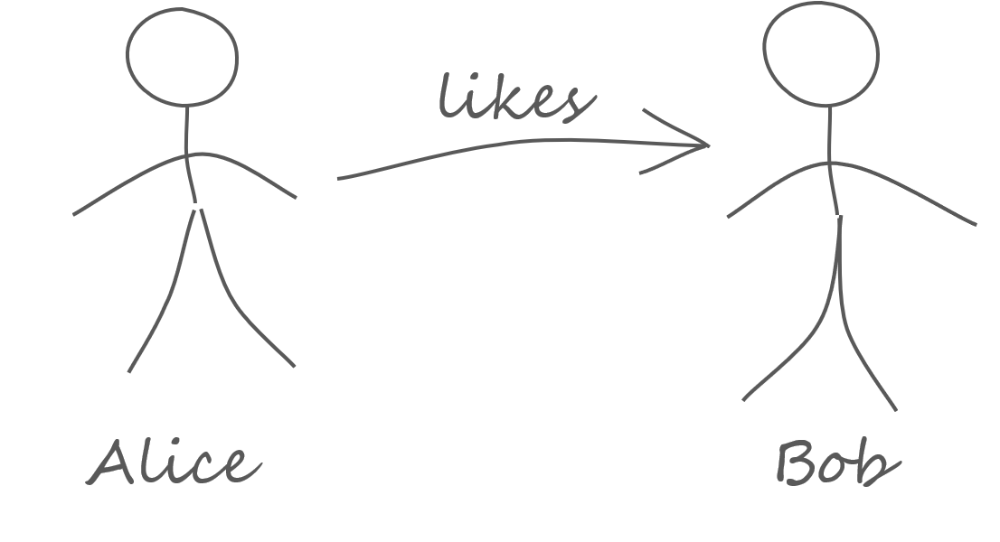

# On Graphs And Models

## Abstract

This is an essay about graphs like and and models.
The main question is how to bring together __Resource Description Framework (RDF)__ and __Property Graphs (PG)__.
The bridge is not a technical thing like _RDF*_.
The main difference between RDF and PG lies deeper in a basic decision how to do modelling.

With this essay I want to investigate this modeling styles.
The conclusions are the foundation for a generalized view on graphs and modeling which in in turn is the basis for technical solutions that harmonize RDF and PGs. 

## Alice and Bob

<figure>

<figcaption>Image 1.</figcaption>
</figure>

Let's talk about Alice and Bob. Alice is very fond of Bob, but there feelings of Bob for her are unknown. We now draw a picture of this situation. What we have done is already a model. A __model__ is a simplified image of reality.

Our model has a concern: it is about persons and their relationship. There are things which are of interest and other things which are not considered here.
When we gossip about Alice and Bob it might also be of interest that Bob is a tall, handsome man or that Alice has a new hairstyle. For the moment, we are ignoring all these facts. We can reduce our model so that it reflects only what we are talking about.

<figure>

<figcaption>Image 2.</figcaption>
</figure>
 

The new model is more abstract than the first. Can we continue with this abstracting process? If we look closely at the second image we see that the model consists of specific _elements_: There are bubbles, an arrow and words. 

The bubbles and the arrow are very different . 
Without knowing it we have already made a design decision: we are distinguishing between things and their relationship. Things are represented by bubbles and relationships are represented by arrows.

To be able to recognize who we are talking about we use the individuals' names.
The bubbles represent things which are _identified_ by a name.
Also the relationship is identified by the word 'likes'.

So far everything seemed to be very natural. If we develop our model further we have to we make more design decisions. This is a crucial point because the next steps are somehow arbitrary. 

## Naming Things Unambiguously 

One might ask: "I know two women with the name 'Alice'. Which one do you mean?". Of course, we could simply use the family name, but let us try to solve this problem once for all.

Creating a unique name is a very hard problem. You cannot prevent that anybody using the same name for something different. The only solution is to use a system that provides the technical and organizational means allows you to create, register and look up names globally. 

The __Internet Assigned Numbers Authority__ provides such a system, the __Domain Name System__ and many other organizational services that allow you to create, register and maintain a globally unique technical identifier, the __Uniform Resource Identifier (URI)__.

Let's create URIs for Alice and Bob. The technical Details of these URIs are not of interest here, therefore I simply write `<Alice>` and `<Bob>`. 

The name 'likes' is an English word but there is no reason why our model should be understood by everyone. So we also introduce an URI for the relationship `<likes>`.
Now the model looks a bit more technial.

<figure>

<figcaption>Image 3.</figcaption>
</figure>

## 
 